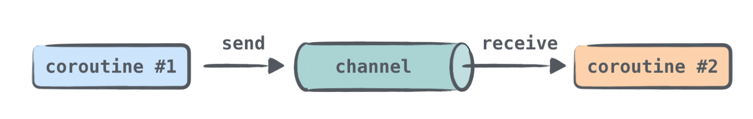

# Dies ist die Umsetzung des Tutorials hinter dem folgenden Link
[Link zum Tutorial](https://play.kotlinlang.org/hands-on/Introduction%20to%20Coroutines%20and%20Channels/01_Introduction)

Ich habe hier die Klassen bis zum Kapitel 5 angepasst und die Aufgaben durchgeführt und zwar auf dem Stand vom 01.11.2021

Starten kann man das Programm in der ```main.kt``` Das Fenster, dass sich dann öffnet, bietet die Möglichkeit verschiedene
Aufrufe durchzuführen und sich die Unterschiede im Quellcode anzusehen.

# Channel
Mit Channeln versucht man, Status durch Kommunikation zu teilen, statt den Status durch Objekte zu teilen, die zwei Koroutinen
zur Verfügung stehen. Wie deferred-Werte eine Möglichkeit bieten, einen einzelnen Wert zwischen Coroutinen auszutauschen,
bieten Channel eine Möglichkeit, einen Stream von Werten zwischen Koroutinen zu übertragen.

Channel dienen dazu, Informationen zwischen verschiedenen Koroutinen auszutauschen.



Das GIF wurde aus dem oben genannten Tutorial übernommen.

Man unterscheidet zwischen ```producer``` und ```consumer```. Wenn man es braucht, können mehrere Koroutinen
über einen Channel senden und auch mehrere Koroutinen von einem Channel empfangen. Eine Nachricht, die auf
einen Channel gelegt wird, wird dann aber nur von einem der Empfänger verarbeitet und nicht von allen empfangenden
Koroutinen.

Für mein Problem mit der Anmeldung sehe ich noch nicht, dass ein Channel die Lösung ist, denn eigentlich habe ich dort nur
einen Wert, Anmeldung erfolgt oder Anmeldung nicht erfolgt. Mein Problem ist, dass die aufrufenden Threads eigentlich blocken
müssten, bis die Anmeldung durch ist.