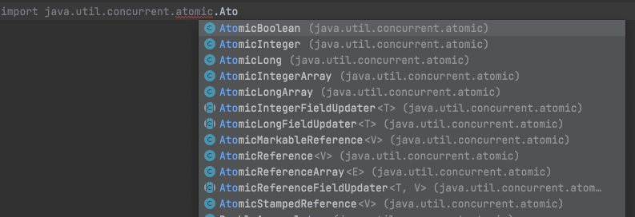
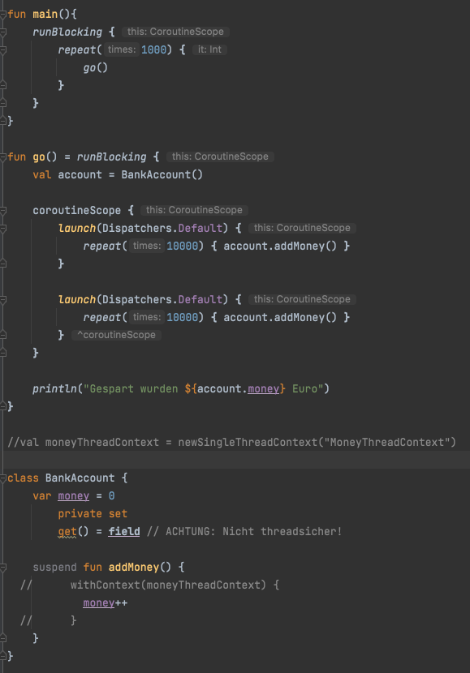

# Hanser-Coroutines
In diesem Paket habe ich Beispiele aus dem Hanser Kotlin-Buch nachempfunden.
Insbesondere die Kapitel zu den Coroutinen und der Nebenläufigkeit sind sehr 
gut zu lesen.

## Nebenläufigkeit und Parallelität
<p><u><b>Parallele Ausführung</b></u> bedeutet, dass die Verarbeitung wirklich gleichzeitig stattfindet.</p>
<p><u><b>Nebenläufige Ausführung</b></u> besagt lediglich, dass die Verarbeitung entweder parallel oder abwechselnd ausgeführt wird</p>
Der Begriff der parallelen Ausführung ist also strenger gefasst als die Nebenläufigkeit. Beide Begriffe beschreiben die 
<u><b>asynchrone Verarbeitung bzw. asynchrone Algorithmen</b></u>.

### Definition nebenläufiger Algorithmus
<p>
    <i>
        „Zwei Algorithmen A und B können nebenläufig ausgeführt werden, wenn sie unabhängig voneinander ablaufen können. 
        Durch diese Unabhängigkeit kann die Reihenfolge vertauscht werden, d. h. A kann vor B ablaufen und andersherum. 
        Es kann sogar während des Ablaufs zwischen A und B gewechselt werden. Dies ist möglich, da jeder der Algorithmen 
        seinen eigenen Ablaufstrang (Thread) besitzt. Aufgrund der Unabhängigkeit können A und B sogar gleichzeitig, 
        also parallel, ausgeführt werden.“
    </i>

Auszug aus: Christian Kohls. <cite>„Programmieren lernen mit Kotlin.“</cite>
</p>

## Koroutinen und Threads Ähnlichkeiten und Unterschiede
<ul>
    <li>jeder Thread hat eine eigene unabhängige Ablaufkontrolle und einen eigenen Stack</li>
    <li>Threads werden durch den Scheduler des Betriebssystems gesteuert</li>
    <li>Threadverwaltung ist teuer</li>
    <li>Koroutinen kann man sich wie leichtgewichtige Threads vorstellen, die sich einen Thread teilen können</li>
    <li>Koroutinen arbeiten kooperativ, denn sie blockieren sich nicht</li>
    <li>Koroutinen sorgen dafür, dass die für einen nebenläufigen Algorithmus erfordeliche Ablaufreihenfolge eingehalten wird</li>
    <li>Koroutinen unterstützen dabei, die  sequentiellen Schritte eines Programmablaufs weiterhin als solche abzubilden 
        und gleichzeitig Teilaufgaben nebenläufig abzuarbeiten.
    </li>
    <li>Koroutinen unterbrechen ihre Arbeit, während ein Thread läuft, bis seine Verarbeitung vollständig ist</li>
    <li>so wie mehrere Threads auf einem Prozessor laufen können, können auch mehrere Koroutinen auf einem Thread
        ablaufen. Die Koroutinen selbst sind dabei unabhängig voneinander.
    </li>
</ul>
<u><b>Koroutinen darf man nicht mit suspending functions verwechseln. In einer Koroutine darf man
      suspending Functions verwenden, Koroutinen und suspending Functions sind aber nicht dasselbe...
</b></u>

### Definition Koroutine

<p>
    <i>
        „Eine Koroutine ist ein unabhängig ausführbarer Algorithmus. Mehrere Koroutinen können nebenläufig und parallel 
        ausgeführt werden. Konzeptionell sind Koroutinen sehr ähnlich zu Threads. Koroutinen legen ebenfalls unabhängige 
        Ablaufstränge eines Algorithmus fest. Eine Koroutine ist leichtgewichtiger, benötigt also weniger eigene 
        Ressourcen als ein Thread, und das Zusammenspiel der Koroutinen geschieht kooperativ.“
    </i>

Auszug aus: Christian Kohls. <cite>„Programmieren lernen mit Kotlin.“</cite>     
</p>

## Korutinen Scopes
<p>Der Koroutinen Scope stellt einen Gültigkeitsbereich für eine Koroutine zur Verfügung.
   In einem Scope arbeiten alle Koroutinen als kooperierende Einheit zusammen.
   Den Global-Scope sollte man nur mit Vorsicht nutzen, im Fehlerfall kann ansonsten das ganze Programm abbrechen
   und nicht nur wie evtl. gewünscht alle Koroutinen in einem bestimmten Scope.
</p>

## Korutinen Builder
```kotlin    
val a = GlobalScope.launch { println("Eine Koroutine wird im Global-Scope gestartet ...") }
```
<p>runBlocking steht sowohl im Global Scope als auch direkt in der main-Funktion zur Verfügung. Läuft runBlocking im 
   GlobalScope, wird die Ausführung an einen Worker-Thread weitergegeben, läuft runBlocking direkt in der main-Funktion,
   erfolgt die Ausführung auf dem main-Thread. Man hat damit also eine Möglichkeit, das Programm so lange ausführen zu
   lassen, bis alle nebenläufigen Tasks ausgeführt sind.
</p>

```kotlin    
val a = runBlocking{
    println("... startet eine Koroutine im selben Scope und wartet, bis alle Anweisungen dahinter abgearbeitet sind") 
    // Diese Funktion steht nur in der JVM zur Verfügung, nicht unter JavaScript  
}
```

<p>
    <i>
        
"Der Launch-Builder launch dient dazu, aus einer existierenden Koroutine heraus weitere Koroutinen zu erzeugen. 
Mit GlobalScope.launch können Sie eine Koroutine im globalen Scope erzeugen. 
runBlocking wird eingesetzt, um aus einem regulären, eventuell blockierenden Programmablauf in einen Koroutinen-Scope zu wechseln. 
Erst wenn alle Koroutinen innerhalb von runBlocking vollständig abgearbeitet sind, wird in den regulären Programmablauf 
zurückgekehrt. Wenn auf die Abarbeitung aller Koroutinen gewartet werden muss, weil etwa noch eine Serverantwort aussteht, 
dann wird der Thread, der runBlocking aufgerufen hat, blockiert, bis alles erledigt ist."


</i>
Auszug aus: Christian Kohls. „Programmieren lernen mit Kotlin." 
</p>

## Haupt-Thread und Daemon-Thread
<p>
    <i>
        „Die main-Funktion läuft im Haupt-Thread der Anwendung. Es handelt sich also um den Hauptablaufstrang der Anwendung. 
        Wenn runBlocking in diesem Thread aufgerufen wird, dann blockiert dieser Thread, bis alle darin gestarteten 
        Koroutinen abgearbeitet sind. Sobald der Haupt-Thread beendet ist, endet auch das Programm.
        Bei den Threads aus dem globalen Scope handelt es sich um sogenannte Daemon-Threads, die nur solange laufen, 
        wie der Haupt-Thread läuft. Dies ist ein Unterschied zu selbst erzeugten Threads. Wenn man z. B. mit Thread() 
        einen eigenen Thread erzeugt und diesen startet, dann läuft das Programm solange, bis auch dieser Thread 
        abgearbeitet ist. In Java war diese Art der schwergewichtigen Thread-Erzeugung üblich. Sie hat aber den Nachteil, 
        dass ein Programm weiterläuft, selbst wenn der Haupt-Thread schon lange beendet ist. Dies ist eine typische Fehlerquelle.
        Mit Koroutinen haben Sie mehr Sicherheit. Wenn der Haupt-Thread beendet ist, dann ist auch Ihr Programm beendet.“
    </i>

Auszug aus: Christian Kohls. <cite>„Programmieren lernen mit Kotlin.“</cite> 
</p>

## Der Job um Abläufe zu synchronisieren
join unterbricht die Ausführung des aktuellen Codes, bis der Job erledigt ist. Der job ist das Objekt, das die Ausführung
des Arbeitsauftrags repräsentiert.
```kotlin    
val firstJob = GlobalScope.launch {
        ...
    }
firstJob.join()
```

Möchte man von einem asynchronen Prozess auch einen Wert zurückerhalten, so gibt es dafür die async - Funktion 
```kotlin 
runBlocking {
    // berechne sei eine lang andauerde Berechnung...
    val a = async { berechne(12) }
    val b = async { berechne(13) }
    val ergebnis = a.await() + b.await()
}   
val firstValue = GlobalScope.async{
        ...
    }
firstJob.join()
```

## Suspending Functions
Bei den suspending Function fand ich es am schwierigsten, zu entscheiden, ob beim Aufruf einer suspending 
Function die nächste suspending Funktion im selben Algorithmus dann trotzdem aufgerufen wird. Der folgende 
Programmabschnitt zeigt und erklärt die Frage. Gegeben ist die folgende Funktion, die eine komplizierte
Berechnung simuliert:
```kotlin
 suspend fun doSomeCalculation(a: Int, b: Int, function: (Int, Int) -> Int): Int {
    delay(2000)
    return function(a, b)
}
```
Der Delay-Aufruf soll lediglich den langen Lauf des Programms simulieren.

Im folgenden Abschnitt wird die Funktion innerhalb einer Koroutine 2 Mal verwendet.

```kotlin
 launch {
            val a = 5
            val b = 7
            val sum = doSomeCalculation(a, b) { x, y ->
                x + y
            }
            val diff = doSomeCalculation(a, b) { x, y ->
                y - x
            }
            val bothTogether = doSomeCalculation(diff, sum) { x, y ->
                x + y
            }
            println("Summe: $sum, Differenz: $diff und Summe aus beiden ist: $bothTogether")
        }

```

Wenn man die Laufzeit dieses Programms betrachtet oder sich die Ausgabe im Debugger anschaut, wird deutlich,
dass die Aufrufe von doSomeCalculation nacheinander abläuft. Mich lässt das zu dem folgenden Merksatz kommen:

###### Innerhalb einer Koroutine werden alle suspending-Functions sequenziell abgearbeitet. Möchte man eine parallele Verarbeitung erreichen, muss man zwei Koroutinen starten, in dem obigen Fall mit launchn oder async. 

### Auslagerung langläufiger Berechnungen
Die folgende suspending Function würde in einem Programm nie unterbrochen, da sie in der Funktion selbst keinen
unterbrechenden Teil enthält. Die Gefahr ist nun, wenn eine solche Funktion auf dem Main-Thread aufgerufen wird, dass
dann der Main-Thread "steht". Um dies zu umgehen kann man das Muster des folgenden Beispiels verwenden:

```kotlin
suspend fun langDauerndeBerechnung(): Int {
    val asyncResult = GlobalScope.async {
        var res = 0
        repeat(999_999_999) {
            res = it *10 + 3 / (it + 2)
        }
        res
    }
    return asyncResult.await()
}

fun main(){
    println("Start des Programms")
    runBlocking {
        println("Ergebnis der Berechnung: ${langDauerndeBerechnung()}")
    }
    println("Ende des Programms")
}
```
Der Trick besteht darin, dass innerhalb der suspending-Function ein Worker-Thread gestartet wird, sodass der main-Thread
gar nicht geblockt werden kann.

## Koroutinen-Dispatcher
Wenn man steuern möchte, auf welchem Thread eine Koroutine läuft, kann man dem launch oder async-Befehl einen 
Koroutinen-Kontext mitgeben. Dieser hat einen Dispatcher, der die Koroutinen auf die Threads verteilt.

## Race-Conditions
Bei den Race-Conditions geht es um die nebenläufigen Zugriffe auf eine Variable, die mindestens zwei Threads oder zwei 
Koroutinen gleichzeitig zur Verfügung steht.

### Definition Atomare Operation
<p>
    <i>
        „Eine atomare Operation wird stets vollständig und als Ganzes ausgeführt. Sie kann aus einzelnen Operationen 
        bestehen, die aber stets als logische Einheit betrachtet und untrennbar voneinander ausgeführt werden. 
        Eine Unterbrechung der atomaren Operation ist von außen nicht möglich, auch nicht präemptiv durch 
        das Betriebssystem.“
</i>

Auszug aus: Christian Kohls. <cite>„Programmieren lernen mit Kotlin.“</cite>
</p>

Möglichkeiten für atomare Operationen zu sorgen sind die folgenden:
<ul>
    <li>Threadsichere Typen</li>
    <li>Thread-Confinement (Thred-Beschränkung / Einengung)</li>
    <li>Markieren kritischer Abschnitte (Mutex)</li>
</ul>

### Threadsichere Typen
Schon in Java gibt es zur threadsicheren Programmierung atomare Datentypen. Diese stellen inhärent sicher, dass sie 
threadsicher verändert werden.



### Thread-Confinement
Beim Thread-Confinement sorgt man programmatisch dafür, dass immer nur derselbe Thread verändernd auf die
Variablen zugreifen darf. Dies erreicht man durch den Coroutine-Builder withContext. Hier der Auszug aus dem Buch:

<p>
    <i>
        „Die Funktion withContext ist ein weiterer Coroutine Builder. 
        Ihr wird ein Codeblock übergeben, der von einem festgelegten Dispatcher ausgeführt werden soll. 
        Nach Ausführung des Codeblocks wird der ursprüngliche Dispatcher des Coroutine Contexts wieder verwendet, 
        um den verbleibenden Code auszuführen. Wenn also z. B. vorher Dispatchers. IO verwendet wurde, dann wird nach 
        Ausführung des Codes, der an withContext übergeben wurde, wieder auf Dispatchers. IO gewechselt.“
</i>

Auszug aus: Christian Kohls. <cite>„Programmieren lernen mit Kotlin.“</cite>
</p>

Lässt man das folgende Programm ohne die auskommentierten Zeilen laufen, ist es nicht threadsicher und liefert eine 
Ausgabe wie die darunter stehende:



```log
Gespart wurden 20000 Euro
Gespart wurden 20000 Euro
Gespart wurden 19083 Euro
Gespart wurden 17906 Euro
Gespart wurden 18865 Euro
Gespart wurden 18745 Euro
Gespart wurden 19975 Euro
Gespart wurden 19807 Euro
```

Mit den auskommentierten Zeilen dagegen, werden die Zugriffe auf die money-Variable nur durch den moneyThreadContext
durchgeführt und das Programm ist threadsicher. Das Programm ist hier zu finden

[Programmcode](./raceconditions/threadConfinement.kt)
     
###  Markieren kritischer Abschnitte (Mutex)
Bei einem Mutex können verschiedene Threads einen kritischen Abschnitt nutzen, der Mutex verhindert allerdings die
gleichzeitige Nutzung. Wichtig ist bei Zugriffen, die durch einen Mutex geschützt sind, dass sowohl der lesende als
auch der schreibende Zugriff durch den Mutex geschützt werden. Nur so ist sichergestellt, dass nicht ein Thread liest,
während ein anderer schreibt.

```kotlin
private val MyMutex = Mutex()

suspend fun functionUsingMutex() {
    MyMutex.withLock() {
        // hier steht der Zugriff auf die geschützte Variable ...
    }
}
```

Man kann ein Mutex-Objekt auch per Hand mit ```lock()``` sperren und mit ```unlock()```entsperren.